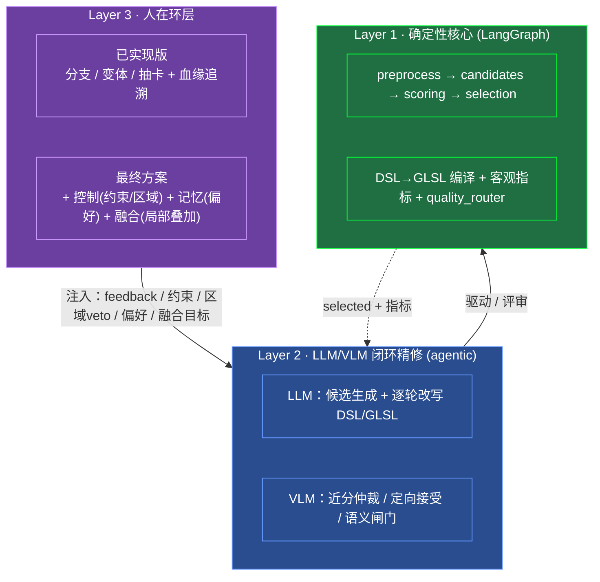
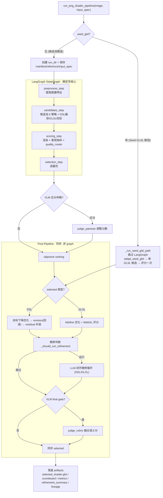
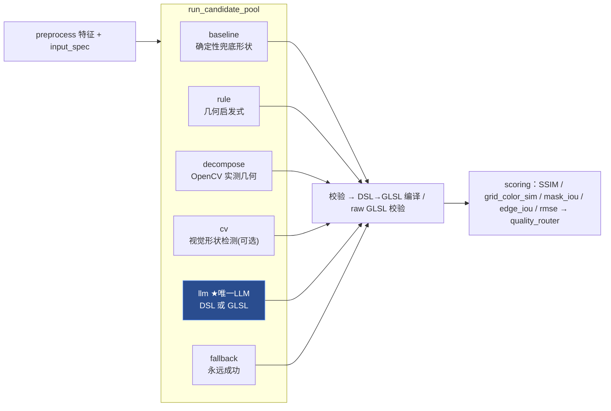
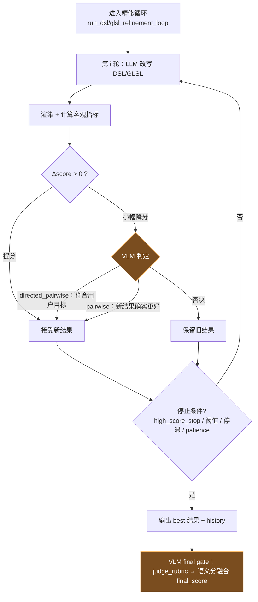
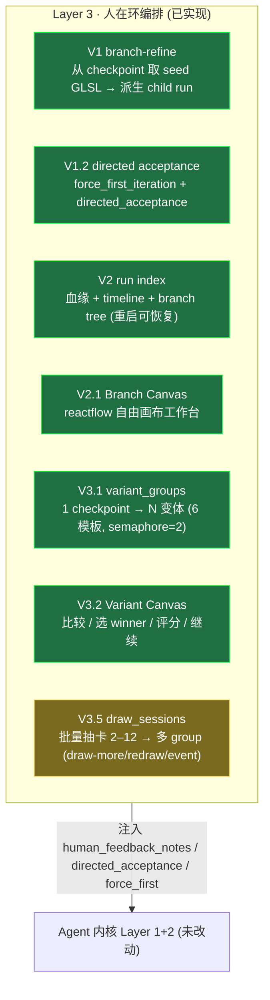
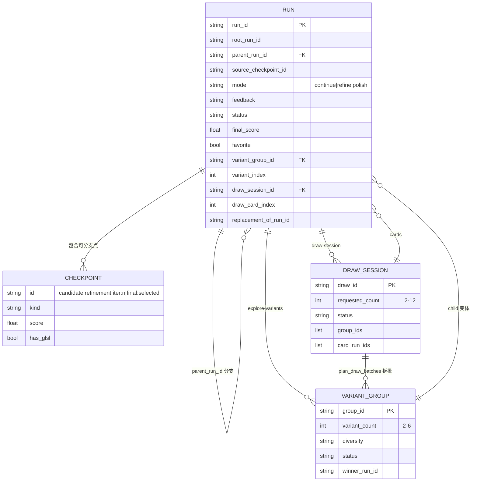
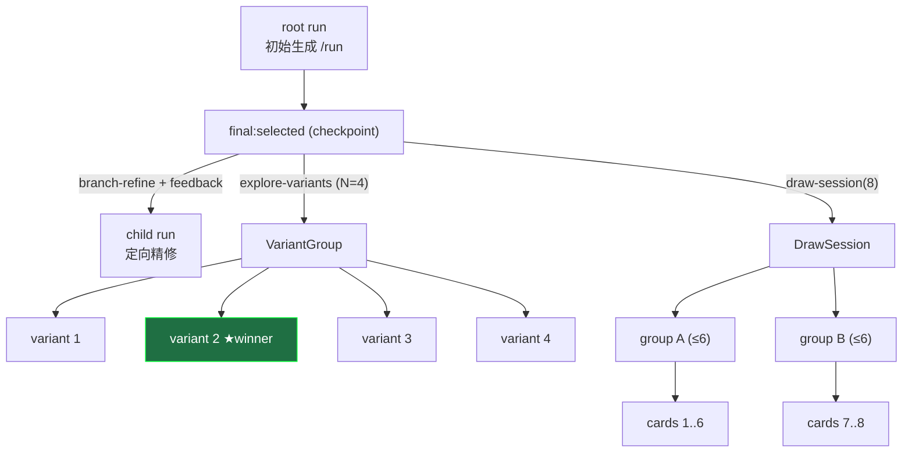
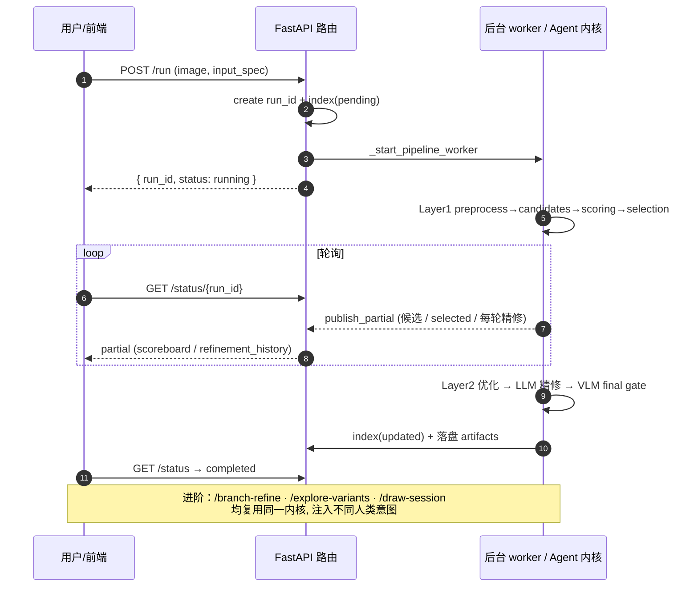
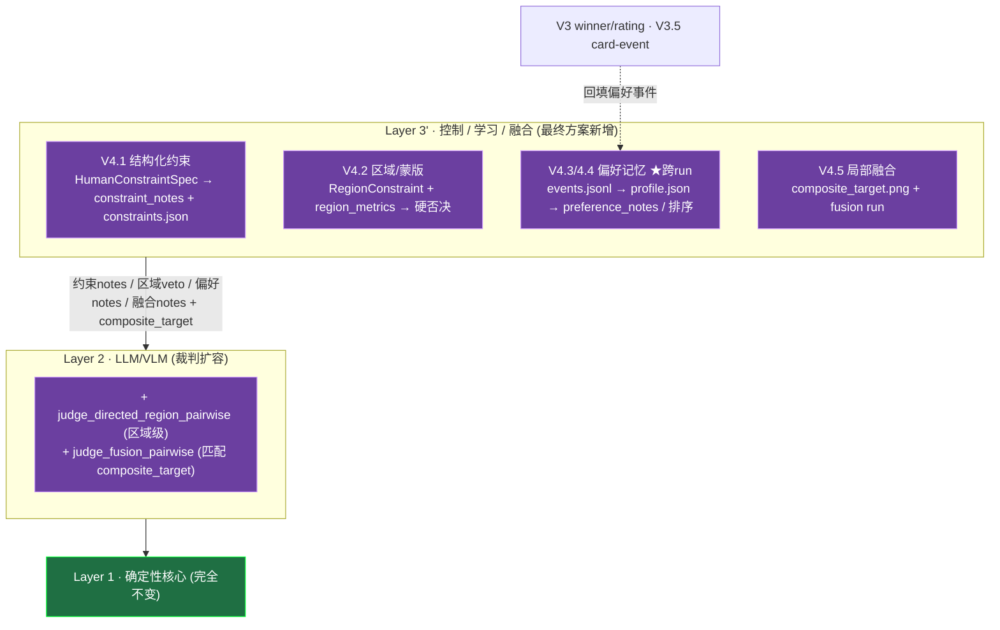
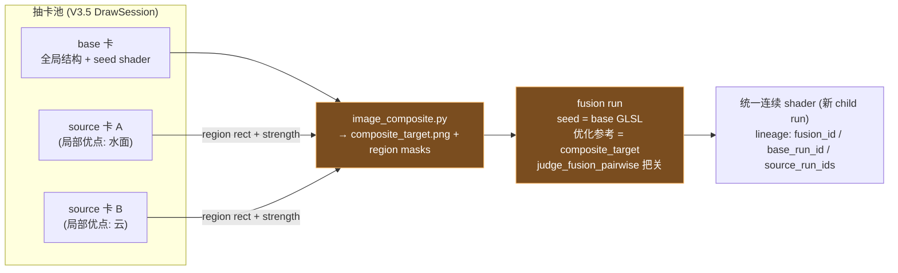

# P2S-Agent 架构与使用流程总览

> **用途:** 本文档作为 PPT 生成输入。涵盖 (1) 当前已实现版本架构、(2) 最终方案架构、(3) 当前版本使用流程 (SOP)。
> **重点:** Agent 技术架构（LangGraph 内核 + LLM/VLM 闭环 + 人在环编排）。
> **日期:** 2026-06-16　**对应分支:** `feat/human-in-loop-v3.5-batch-draw`
> **图表说明:** 所有图为 Mermaid（GitHub / 多数 Markdown 工具可直接渲染，亦可导出 PNG/SVG 插入 PPT）。

---

## 0. 建议幻灯片大纲（PPT 目录）

| # | 幻灯片 | 取材章节 | 配图 |
|---|--------|----------|------|
| 1 | 封面：P2S-Agent — PNG → GLSL Shader 智能体 | §1 | — |
| 2 | 一句话定位 + 能力全景 | §1 | — |
| 3 | 三层架构总览（两版共享内核） | §2 | 图 1 |
| 4 | Agent 内核：端到端核心流程图 | §3.1 | 图 2 |
| 5 | Agent 内核：候选池 6 策略 | §3.2 | 图 3 |
| 6 | Agent 内核：LLM 闭环精修决策 | §3.3 | 图 4 |
| 7 | 两条入口路径：候选池 vs Seed-GLSL | §3.4 | 图 2 |
| 8 | 已实现版本：+ 人在环编排层 (V1–V3.5) | §4.1 | 图 5 |
| 9 | 已实现版本：数据模型 ER | §4.2 | 图 6 |
| 10 | 已实现版本：run 血缘森林 | §4.3 | 图 7 |
| 11 | **SOP①：基础单图生成闭环** | §5.1 | 图 8 |
| 12 | **SOP②③④：分支 / 变体 / 抽卡** | §5.2–5.4 | 图 7 |
| 13 | **SOP：端到端时序图** | §5.5 | 图 8 |
| 14 | 最终方案：+ 控制 / 记忆 / 融合 (V4.1–V4.5) | §6 | 图 9 |
| 15 | 最终方案：融合数据流 | §6.5 | 图 10 |
| 16 | 两版对比表 | §7 | — |
| 17 | 演进路线图与现状 | §8 | 图 11 |
| 18 | 附录：端点 / 模块 / 术语 | §9 | — |

---

## 1. 产品定位与能力全景

**一句话定位：** 把一张 PNG 图像，通过「确定性候选生成 + LLM 改写 + VLM 评审」的闭环，自动转换成可运行的 GLSL（Shadertoy）着色器；并支持人在环地分支、批量探索与（最终方案）局部融合。

**技术栈：** LangGraph（流程编排）· FastAPI（后端服务）· React + Vite + Tailwind（前端）· WebGL（着色器渲染评分）· LLM/VLM（生成与评审）。

**能力全景（已实现）：**
- 单图一键生成着色器，多候选并比，客观指标 + 语义评审双重把关。
- LLM 闭环精修（DSL 路径 / GLSL 路径），实时进度可见。
- 人在环：从任意 checkpoint 分支精修、一次产 N 个变体、批量抽卡（API）。
- 全链路可追溯：run 血缘 + checkpoint 时间线 + artifacts 落盘 + 重启可恢复。

---

## 2. 三层架构总览（两版共享内核）

整个系统是**三层**结构。两版差异只在 **第 3 层**及它对第 2 层的「注入内容」；第 1、2 层是两版**共享的 Agent 本体**。

**图 1 · 三层架构**



**关键认知：** 「Agent」本体 = Layer 1 + Layer 2，即一次 PNG→Shader 的**单 run 闭环优化器**。Layer 3 是把这个优化器反复调度、并喂入不同人类意图的「编排/控制层」。

---

## 3. Agent 内核详解（Layer 1 + Layer 2，两版共享）

统一入口：`run_png_shader_pipeline(...)`（`backend/app/pipeline/graph.py`）。

### 3.1 端到端核心流程

**图 2 · 核心流程图**（与 `graph.py:CORE_PIPELINE_FLOWCHART` 一致）



### 3.2 候选池 6 策略

**图 3 · 候选池**（仅 `llm` 调 LLM，其余确定性）



### 3.3 LLM/VLM 闭环精修决策（Layer 2 核心）

> `_run_post_pipeline(...)`，**不在 LangGraph 图里**，作为选最优后的同步后处理。这是人在环 feedback / 定向接受的**唯一注入点**。

**图 4 · 精修循环接受/停止决策**



**LLM 角色：** ① 候选生成（1 次）；② 闭环精修逐轮改写 DSL/GLSL。
**VLM 角色（裁判，可失败降级为纯指标）：** `judge_pairwise`（近分仲裁 + 小幅降分否决）· `judge_directed_pairwise`（带用户目标定向接受）· `judge_rubric`（最终语义闸门）。

### 3.4 两条入口路径

| 路径 | 触发 | 流程 |
|------|------|------|
| **候选池路径** | 普通 `/run` | 走完整 LangGraph 4 节点 → `_run_post_pipeline` |
| **Seed-GLSL 路径** | `/run` 带 `seed_glsl` | **跳过 LangGraph**：`adapt_seed_glsl` 适配 → 合成单候选 → 评分一次 → 直接 `_run_post_pipeline`（强制 GLSL 渲染 + 精修 `on`） |

---

## 4. 已实现版本架构（+ Layer 3 人在环编排，V1 → V3.5）

在内核之上加 **Layer 3 编排层**：把「单 run agent」变成「**可分支、可批量、可追溯的 run 森林**」。
**注意：它不改 Agent 的决策依据，只是反复调度内核，并向 Layer 2 注入文字 feedback / 定向接受配置。**

### 4.1 编排能力一览

**图 5 · 已实现的人在环编排层**



**实现状态（精确）：**
- ✅ 端到端可用（含前端 UI）：V1 · V2 · V2.1 · V3.1 · V3.2（变体）。
- 🟡 V3.5 批量抽卡：**后端模块 + API 已实现并通过单测**（`draw_sessions.py` / 5 个端点）；**前端尚未接线**（当前分支在做）。
- ⬜ V4.x（约束 / 区域 / 偏好 / 融合）：未实现，属最终方案。

### 4.2 数据模型

**图 6 · 数据模型 ER**（血缘统一记录 + 组/会话）



- **持久化：** append-only JSONL（`run_index.jsonl`），`created`/`updated` 事件折叠成最新状态 → **重启可恢复**整棵分支树；内存 store 仅作 LRU 缓存（上限 100）。
- **Checkpoint：** `candidate:{id}` / `refinement:iter:{n}` / `final:selected`；`list_checkpoints` 给元数据，`resolve_checkpoint` 解析出可作 seed 的 GLSL。
- **变体组 / 抽卡会话：** 各自 `<id>.json` + `<id>_events.jsonl`（winner/rating/card-event 写事件）。
- **并发模型：** 后台线程 worker；变体并发 `threading.Semaphore(2)`；排队中的 child 可在 acquire 前被 stop。

### 4.3 run 血缘森林

**图 7 · 一棵典型的 run 森林**（分支 / 变体 / 抽卡如何长出来）



**前端 Canvas：** `/branches + /timeline + /status` → `buildBranchCanvas` → reactflow 节点/边（input/run/checkpoint/branch_action/variant_group/variant_run），纯**只读视图**，手动拖拽只存本地布局、不污染 run index。

---

## 5. 当前版本使用流程（SOP）

> 以下为**已实现版本**的真实操作流程。基础闭环 + 分支 + 变体已在 UI 可用；批量抽卡当前需经 API。

### 5.1 SOP① 基础单图生成闭环

| 步 | 操作（用户/前端） | 后端 / Agent |
|----|------------------|--------------|
| 1 | 上传 PNG，选模型、LLM 模式、策略预设 | — |
| 2 | 点击 **Run** | `POST /png-shader/run`（multipart：`image` + `input_spec_json`{model/quality/candidates} + 可选 `seed_glsl`） |
| 3 | 拿到 `run_id`，进入 Processing | 创建 run_id → 写 run_index(pending) → 启动后台 worker |
| 4 | **轮询**实时进度 | `GET /png-shader/status/{run_id}` 返回 partial：候选 scoreboard → selected → 精修迭代 → 最终 |
| 5 | 查看结果 | ShaderPreview 实时 WebGL 渲染 + 候选对比 + 指标 + 精修历史 + VLM 评审 |
| 6 | （可选）中途停止 | `POST /runs/{run_id}/stop` |

**关键产物：** `selected_shader.glsl`、`scoreboard.json`、`objective_metrics.json`、`refinement_summary.json`、`reference_input.png`。

### 5.2 SOP② 从 checkpoint 分支精修（V1）

1. 选 checkpoint（`candidate:* / refinement:iter:n / final:selected`）。
2. 填 **feedback**（自然语言目标）+ **mode**（`continue` / `refine` / `polish`）+ 可选 **locks**（保布局/色板/背景/仅小改）。
3. `POST /runs/{run_id}/branch-refine` → 创建 **child run**（seed = 该 checkpoint 的 GLSL，父 run 不被覆盖）。
4. 前端自动切到 child run，复用轮询。
5. **定向接受**：`force_first_refinement_iteration` 强制首轮定向精修；VLM `judge_directed_pairwise` 按用户目标判定，允许「语义更优但小幅降分」被接受。

### 5.3 SOP③ 变体探索（V3.1 / V3.2）

1. 选 checkpoint → 填 feedback + **variant_count(2–6)** + **diversity**（low/medium/high）。
2. `POST /runs/{run_id}/explore-variants` → 一次产 N 个**策略变体**（6 模板：conservative / semantic / lighting_color / detail_texture / structure_form / alt_technique；并发上限 2）。
3. 轮询 `GET /variant-groups/{group_id}`：变体逐个完成，失败变体不阻塞其他。
4. 比较 → **选 winner**（`/winner`）/ 评分（`/ratings`）/ 停止（`/stop`）。
5. 从 winner 继续优化（winner 切为 active run）。

### 5.4 SOP④ 批量抽卡（V3.5，后端 API）

1. 选 checkpoint → feedback + **requested_count(2–12)** + diversity。
2. `POST /runs/{run_id}/draw-session` → `plan_draw_batches` 拆成多个 ≤6 的 VariantGroup（如 12→[6,6]，7→[4,3]）。
3. 轮询 `GET /draw-sessions/{draw_id}`：卡片逐个亮。
4. 卡片操作：`/draw-more` 追加（不覆盖）· `/redraw` 单卡重抽（保留原卡，replacement 可追溯）· `/cards/{run_id}/event` 收藏/淘汰/打标签（为 V4.5 融合预留 `use_as_fusion_base` / `use_as_region_source`）。

### 5.5 端到端时序

**图 8 · 时序图**



---

## 6. 最终方案架构（补齐 V4.1 → V4.5）

最终方案**不动 Layer 1 的图结构**，而是把 Layer 3 从「重复调度器」升级为「**控制 + 学习 + 融合**」层，并给 Layer 2 增加新的输入通道、裁判与优化参考。

**图 9 · 最终方案分层**



### 6.1 V4.1 结构化约束
`HumanConstraintSpec`：`locks`（preserve_layout/palette/background…）+ `targets`（brightness keep/increase/decrease…）+ `edit_strength[0,1]`。→ 转 prompt notes，落 `constraints.json`，由 `branch-refine` / `explore-variants` 接收。

### 6.2 V4.2 区域/蒙版约束
`RegionConstraint`（归一化 rect，mode=modify/protect）+ `region_metrics.py`（只算区域内 SSIM/MSE/delta）。**protect 区域显著变差 → 硬否决**，即使全局分提升也拒绝。端点 `POST /runs/{id}/region-mask`。

### 6.3 V4.3 偏好事件 / 档案
`PreferenceEvent` → `events.jsonl`（append-only）→ **确定性 rebuild** → `profile.json`。从 V3 winner/rating、V3.5 card-event **回填**。CRUD/rebuild/clear 端点；`enabled=false` 时不注入。

### 6.4 V4.4 偏好辅助生成 / 排序
`build_preference_notes(profile)` 把正/负偏好、偏好变体标签转 prompt notes；profile 快照随请求落盘；变体可加 `preference_score` 辅助排序（不替用户自动选 winner）；可选 LLM summarizer（保留 raw events）。

### 6.5 V4.5 局部融合（核心跃迁）

**图 10 · 融合数据流**



从抽卡池选 **base 卡** + 多张 **source 卡** + 区域 → `image_composite.py` 生成 **`composite_target.png`** → **fusion run**：seed = base 的 GLSL，但**优化参考改为 composite_target**，用区域约束 + `judge_fusion_pairwise` 保证「融成一个连续 shader、不是拼贴」。端点：`/fusions` create / `composite-target` / `run`。

**从「选一个最好」到「合成一个更好」** —— 这是最终方案在 Agent 技术上的最大跃迁。

---

## 7. 两版对比表

| 维度 | 已实现版（V1–V3.5） | 最终方案（+V4.1–V4.5） |
|------|---------------------|------------------------|
| Agent 内核（Layer 1+2） | LangGraph 4 节点 + LLM/VLM 闭环 | **不变** |
| 用户控制粒度 | 一句自然语言 feedback（+ 简单 locks） | 结构化约束(锁/目标/强度) + **区域级**指令 |
| 接受判定依据 | 全局指标 + VLM pairwise / directed | + **区域硬否决** + 偏好提示 + 融合裁判 |
| 优化参考(target) | 仅原始 PNG | 原始 PNG **+ 合成 composite_target.png** |
| 记忆 / 学习 | 无（winner 仅记事件） | **偏好 profile 跨 run 回流** prompt 与排序 |
| 编排拓扑 | 分支 / 变体 / 抽卡树 | + **融合 DAG**（多 source → 一个统一 shader） |
| VLM 裁判 | pairwise / directed / rubric | + region pairwise / fusion pairwise |
| 持久化 | run_index.jsonl + 组/会话事件 | + constraints.json / preferences / fusions |
| 前端 | Branch Canvas（run/checkpoint/变体） | + 约束/偏好/融合节点与编辑器 |

---

## 8. 演进路线图与现状

**图 11 · 版本演进与状态**


**核心原则（路线图既定）：** 先可运行闭环再复杂 UI；先数据可追溯再多分支；先结构化输入再 mask 与偏好；每版可独立验收；不跳测试门禁（后端单测优先，前端至少 `npm run build`）。

---

## 9. 附录

### 9.1 端点清单（人在环）

| 方法 | 路径 | 用途 | 版本 |
|------|------|------|------|
| POST | `/png-shader/run` | 初始 PNG→Shader（multipart） | 核心 |
| GET | `/png-shader/status/{run_id}` | 轮询 run 状态（含 partial） | 核心 |
| POST | `/png-shader/runs/{run_id}/stop` | 停止运行 | 核心 |
| GET | `/png-shader/runs/{run_id}/checkpoints` | 列可分支 checkpoint | V1 |
| POST | `/png-shader/runs/{run_id}/branch-refine` | 从 checkpoint 派生 child run | V1 |
| GET | `/png-shader/runs/{run_id}/timeline` | run 时间线（带 artifacts） | V2 |
| GET | `/png-shader/runs/{run_id}/branches` | 分支树 | V2 |
| PATCH | `/png-shader/runs/{run_id}/metadata` | 改 title/favorite/tags | V2 |
| GET | `/png-shader/runs/{run_id}/artifacts/{id}` | 取 PNG/JSON/GLSL artifact | V2 |
| POST | `/png-shader/runs/{run_id}/explore-variants` | 一次产 N 个变体 | V3.1 |
| GET | `/png-shader/variant-groups/{group_id}` | 变体组状态 | V3.1 |
| POST | `/png-shader/variant-groups/{id}/winner` | 设 winner | V3.1 |
| POST | `/png-shader/variant-groups/{id}/ratings` | 评分 | V3.1 |
| POST | `/png-shader/variant-groups/{id}/stop` | 停止变体组 | V3.1 |
| POST | `/png-shader/runs/{run_id}/draw-session` | 批量抽卡(2–12) | V3.5 |
| GET | `/png-shader/draw-sessions/{draw_id}` | 抽卡会话状态 | V3.5 |
| POST | `/png-shader/draw-sessions/{id}/draw-more` | 追加抽卡 | V3.5 |
| POST | `/png-shader/draw-sessions/{id}/redraw` | 单卡重抽 | V3.5 |
| POST | `/png-shader/draw-sessions/{id}/cards/{run_id}/event` | 卡片事件 | V3.5 |

### 9.2 关键模块清单

| 层 | 模块 | 职责 |
|----|------|------|
| 内核 | `pipeline/graph.py` | LangGraph 编排 + post-pipeline 主流程 |
| 内核 | `candidates/*.py` | 6 策略候选生成 |
| 内核 | `dsl/{schema,compiler,renderer,validator}.py` | DSL 定义与确定性 DSL→GLSL 编译 |
| 内核 | `metrics/{compute,quality_router}.py` | 客观指标 + 质量路由 |
| 内核 | `pipeline/{optimizer,glsl_optimizer,revision,residual_layers}.py` | 参数优化 / 修订 / 补层 |
| 内核 | `pipeline/{refinement,glsl_refinement}.py` | LLM 闭环精修（DSL/GLSL） |
| 内核 | `pipeline/seed_glsl.py` | Seed-GLSL 适配路径 |
| 内核 | `llm/{client,vlm_judge,model_resolver}.py` | LLM 调用 / VLM 评审 / 模型解析 |
| 人在环 | `pipeline/run_index.py` | run 血缘记录 + JSONL 持久化 + 分支树 |
| 人在环 | `pipeline/checkpoints.py` | checkpoint 列举/解析 + timeline |
| 人在环 | `pipeline/human_feedback.py` | 人类反馈 → prompt notes |
| 人在环 | `pipeline/variant_groups.py` | 变体策略 + 组持久化/状态/winner |
| 人在环 | `pipeline/draw_sessions.py` | 批量抽卡批次规划 + 会话 |
| 最终方案 | `human_constraints.py` / `region_metrics.py` / `preferences.py` / `fusion_plans.py` / `image_composite.py` | 约束 / 区域 / 偏好 / 融合（待实现） |

### 9.3 术语

- **Checkpoint：** run 内可作为分支起点的状态（候选 / 精修迭代 / 最终）。
- **Variant Group：** 一次从同一 checkpoint 产生的 N 个策略变体集合。
- **Draw Session：** 抽卡会话，把多变体产品化为可追加/重抽/收藏的批次。
- **Directed Acceptance：** 带用户目标的接受策略，允许语义更优但小幅降分被接受。
- **Composite Target：** 由多张抽卡结果局部融合而成的目标图像，作为融合 run 的优化参考。
- **Hard Veto：** protect 区域显著退化时的硬否决，凌驾于全局分提升。
```
