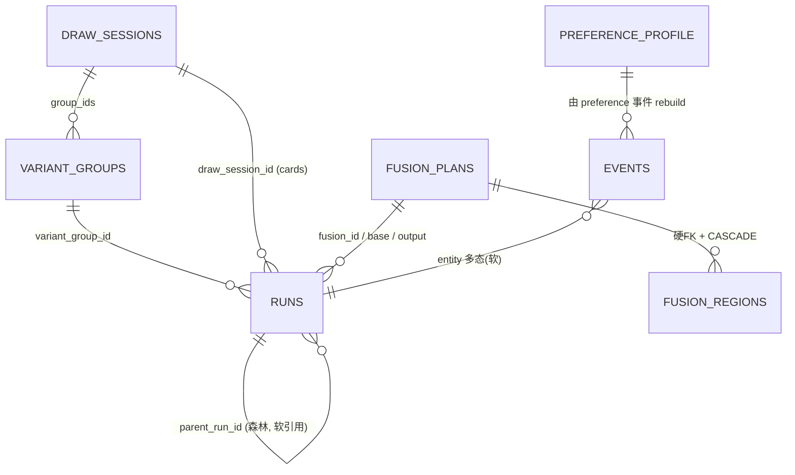

# P2S-Agent 数据层设计：引入 SQLite（嵌入式）

> **日期:** 2026-06-18　**状态:** 待评审（设计已逐节确认）
> **作者:** 设计协作（brainstorming → spec）
> **决策摘要:** 引入 **SQLite**（嵌入式）作为可查询的元数据真相源；**不引入任何中间件**；图片/二进制产物继续留文件系统。访问层用 **SQLAlchemy 2.0 + Alembic**，为「未来可平滑迁 PostgreSQL / openGauss」保留近乎免费的迁移门票。

---

## 0. 背景与决策依据

### 0.1 现状数据设计（盘点）
项目已有一套刻意选择的**文件化、事件溯源（event-sourced）、append-only** 持久化：

| 数据类别 | 现在存在哪 | 机制 |
|---|---|---|
| Run 血缘主索引 | `backend/test_results/run_index.jsonl` | append-only JSONL，`created`/`updated` 事件折叠成最新态；`threading.Lock` 串行写；每次读全量 fold |
| 热态缓存 | 进程内 `_run_store` | LRU 上限 100，仅缓存 |
| 单 run 产物 | `artifacts/run_<id>/`（及 `test_results/<date>_..._<id>/`） | `selected_shader.glsl` / `scoreboard.json` / `objective_metrics.json` / `refinement_summary.json` / `reference_input.png` + `run.jsonl` + `run.log` |
| 变体组 / 抽卡会话 | `<id>.json` + `<id>_events.jsonl` | 快照 + 事件流 |
| 偏好记忆 (V4.3/4.4) | `preferences/events.jsonl` → `profile.json` | 事件溯源，确定性 rebuild |
| 融合 (V4.5) | `fusions/<id>.json` + `_events.jsonl` + `composite_target.png` | 快照 + 二进制 |

所有持久化模块高度同构：stdlib-only + `path/root=None` 测试覆盖 + dataclass record + 容错 load + 原子 `save_json`（temp+`os.replace`）/ 带锁 append。

### 0.2 决策输入（已确认）
- **部署形态：** 单用户本地工具（长期）。→ 排除一切服务端 DB + 中间件。
- **痛点（三项都真实）：** 查询/检索能力不够、并发/一致性担忧、数据量/性能。→ 排除「什么都不做」。
- **选型约束：** 自由选型、开源优先、倾向零运维。→ 指向嵌入式数据库。

### 0.3 结论
> **数据库：要，但只上 SQLite（嵌入式）。中间件：不要。图片：继续放文件系统、库里只存路径。**

SQLite 一次解掉三痛点，且部署形态完全不变（一个本地文件、无守护进程、无端口）；`sqlite3` 驱动是 Python 标准库。为保证「未来可迁 Postgres/openGauss」，访问层用 SQLAlchemy（不要裸 `sqlite3`）+ Alembic 管迁移。

| 痛点 | 文件方案现状 | SQLite 如何解 |
|---|---|---|
| 查询/检索不够 | 全量 fold 后内存筛选 | 真索引 + SQL，任意组合筛选/排序/聚合 |
| 并发/一致性 | 手写全局锁 + 读改写竞态 | WAL（多读并发+单写）+ **ACID 事务** |
| 数据量/性能 | O(N) 全文件 fold | O(log N) 索引查找 |

---

## 1. 架构与边界

### 1.1 核心原则：换底盘，不换方向盘
保留每个持久化模块的**公开函数签名**（`append_run_created` / `load_run_index` / `build_branch_tree` / `save_group` / `load_group` / `save_session` / `load_plan` / `append_preference_event` / `load_profile` …），仅把内部实现从「读写文件」换成「读写 SQLite」。**路由层、pipeline 内核、前端零改动。** 原 `path/root=None` 测试参数顺势变成「DB 引擎/目录覆盖」。

### 1.2 三层数据边界

| 层 | 放什么 | 为什么 |
|---|---|---|
| **SQLite**（新增，可查询真相源） | `runs` · `variant_groups` · `draw_sessions` · `fusion_plans`(+`fusion_regions`) · `preference_profile` · `events`(通用事件表) | 三痛点全在这层解决 |
| **文件系统**（基本不动） | per-run 产物目录：`*.glsl` / `*.png`（含 `composite_target.png`）/ `scoreboard.json` / `metrics.json` + 单 run 的 `run.jsonl` + `run.log` | 二进制/可重生成产物天然属于文件；库里只存**路径** |
| **内存**（不动） | `_run_store` LRU(100) 热缓存 | 服务「正在跑的 run」实时态，与持久层正交 |

### 1.3 事件溯源处理
1. **全局 `run_index.jsonl`** → 收敛成 `runs` 当前态表（原地 UPDATE）。ACID 本身保证持久与重启可恢复，不再需要 fold。
2. **per-entity 事件流**（变体组/抽卡/融合/偏好的 `*_events.jsonl`）→ 收进**通用 `events` 表**（`entity_type, entity_id, event_type, payload(JSON), ts`），统一 append/查询；偏好 profile 仍从 events 确定性 rebuild。
3. **per-run `run.jsonl`** → 高频写、单 run 无争用、只服务实时轮询、不参与跨 run 查询 → **留在磁盘**。

### 1.4 选型栈
```
驱动      stdlib sqlite3（零新驱动依赖）
访问层    SQLAlchemy 2.0 Core      ← 抹平方言，未来迁 Postgres 改连接串即可
迁移管理  Alembic                  ← schema 版本化
连接      单 Engine + WAL + busy_timeout + check_same_thread=False
库文件    backend/data/p2s.db
```

---

## 2. 表结构（DDL）与 ER

### 2.1 ER 总览


### 2.2 关键建模决策
| 决策 | 选择 | 理由 |
|---|---|---|
| 血缘引用（parent/root/source_run_ids） | **软引用**（带索引列，不加硬 FK） | `build_branch_tree` 容忍 parent 被淘汰/不在 family；硬 FK 会破坏容错 |
| fusion_regions | **拆子表 + 硬 FK + `ON DELETE CASCADE`** | 真正「被拥有」的父子关系，删 plan 自动清 region |
| 列表/字典字段（tags / source_run_ids / group_ids / card_run_ids / metadata / geometry / default_locks） | **`JSON` 列** | 数量小、随记录原子读写；SQLAlchemy 通用 `JSON` → Postgres 自动落 `JSONB` |
| child_run_ids / group_ids 等反范式列表 | 保留 JSON，规范化真相是 `runs.*` 反向引用 | 兼容现有 API 返回值；单写串行下不会脏 |
| 按 tag 查询 | tags 存 JSON + `json_each` 过滤 | 千级 run 扫描足够；热了再加 `run_tags` 表或生成列索引 |
| preference_profile | 单行表（`CHECK(id=1)`） | profile 是 events 折叠的单例，保 `load/save/patch_profile` 语义 |

### 2.3 DDL（SQLite 方言；实际由 SQLAlchemy 模型 + Alembic 生成）
```sql
-- 1) runs：血缘 + 元数据主表（取代 run_index.jsonl 折叠）
CREATE TABLE runs (
    run_id                  TEXT PRIMARY KEY,
    root_run_id             TEXT NOT NULL,
    parent_run_id           TEXT,
    source_checkpoint_id    TEXT,
    source_checkpoint_label TEXT,
    mode                    TEXT,
    feedback                TEXT,
    title                   TEXT,
    status                  TEXT NOT NULL DEFAULT 'unknown',
    run_dir                 TEXT,
    created_at              REAL NOT NULL,
    completed_at            REAL,
    final_score             REAL,
    favorite                INTEGER NOT NULL DEFAULT 0,   -- bool 0/1
    tags                    TEXT NOT NULL DEFAULT '[]',   -- JSON
    variant_group_id        TEXT,
    variant_index           INTEGER,
    variant_label           TEXT,
    draw_session_id         TEXT,
    draw_card_index         INTEGER,
    replacement_of_run_id   TEXT,
    fusion_id               TEXT,
    base_run_id             TEXT,
    source_run_ids          TEXT NOT NULL DEFAULT '[]'    -- JSON
);
CREATE INDEX idx_runs_root   ON runs(root_run_id);
CREATE INDEX idx_runs_parent ON runs(parent_run_id);
CREATE INDEX idx_runs_status ON runs(status);
CREATE INDEX idx_runs_score  ON runs(final_score);
CREATE INDEX idx_runs_created ON runs(created_at);
CREATE INDEX idx_runs_fav    ON runs(favorite) WHERE favorite = 1;  -- 部分索引
CREATE INDEX idx_runs_vgroup ON runs(variant_group_id);
CREATE INDEX idx_runs_draw   ON runs(draw_session_id);
CREATE INDEX idx_runs_fusion ON runs(fusion_id);

-- 2) variant_groups
CREATE TABLE variant_groups (
    group_id             TEXT PRIMARY KEY,
    root_run_id          TEXT NOT NULL,
    parent_run_id        TEXT NOT NULL,
    source_checkpoint_id TEXT NOT NULL,
    feedback             TEXT NOT NULL DEFAULT '',
    mode                 TEXT NOT NULL DEFAULT '',
    variant_count        INTEGER NOT NULL DEFAULT 0,
    diversity            TEXT NOT NULL DEFAULT 'medium',
    status               TEXT NOT NULL DEFAULT 'queued',
    child_run_ids        TEXT NOT NULL DEFAULT '[]',   -- JSON
    winner_run_id        TEXT,
    created_at           REAL NOT NULL DEFAULT 0,
    completed_at         REAL,
    draw_session_id      TEXT
);
CREATE INDEX idx_vg_root ON variant_groups(root_run_id);
CREATE INDEX idx_vg_draw ON variant_groups(draw_session_id);

-- 3) draw_sessions
CREATE TABLE draw_sessions (
    draw_id              TEXT PRIMARY KEY,
    root_run_id          TEXT NOT NULL,
    parent_run_id        TEXT NOT NULL,
    source_checkpoint_id TEXT NOT NULL,
    feedback             TEXT NOT NULL DEFAULT '',
    status               TEXT NOT NULL DEFAULT 'queued',
    requested_count      INTEGER NOT NULL DEFAULT 0,
    diversity            TEXT NOT NULL DEFAULT 'medium',
    mode                 TEXT NOT NULL DEFAULT 'batch_draw',
    group_ids            TEXT NOT NULL DEFAULT '[]',   -- JSON
    card_run_ids         TEXT NOT NULL DEFAULT '[]',   -- JSON
    winner_run_id        TEXT,
    created_at           REAL NOT NULL DEFAULT 0,
    updated_at           REAL,
    completed_at         REAL,
    metadata             TEXT NOT NULL DEFAULT '{}'    -- JSON
);
CREATE INDEX idx_draw_root ON draw_sessions(root_run_id);

-- 4) fusion_plans
CREATE TABLE fusion_plans (
    fusion_id                    TEXT PRIMARY KEY,
    root_run_id                  TEXT NOT NULL,
    parent_run_id                TEXT NOT NULL,
    base_run_id                  TEXT NOT NULL DEFAULT '',
    source_run_ids               TEXT NOT NULL DEFAULT '[]',  -- JSON
    draw_session_id              TEXT,
    feedback                     TEXT NOT NULL DEFAULT '',
    status                       TEXT NOT NULL DEFAULT 'draft',
    composite_target_artifact_id TEXT,
    output_run_id                TEXT,
    created_at                   REAL NOT NULL DEFAULT 0,
    updated_at                   REAL,
    metadata                     TEXT NOT NULL DEFAULT '{}'   -- JSON
);
CREATE INDEX idx_fusion_root ON fusion_plans(root_run_id);

-- 5) fusion_regions（子表；删 plan 级联清理）
CREATE TABLE fusion_regions (
    fusion_id     TEXT NOT NULL REFERENCES fusion_plans(fusion_id) ON DELETE CASCADE,
    region_id     TEXT NOT NULL,
    ordinal       INTEGER NOT NULL,            -- 保序
    label         TEXT NOT NULL DEFAULT '',
    source_run_id TEXT NOT NULL DEFAULT '',
    instruction   TEXT NOT NULL DEFAULT '',
    geometry_type TEXT NOT NULL DEFAULT 'rect',
    geometry      TEXT NOT NULL DEFAULT '{}',  -- JSON {x,y,w,h}
    strength      REAL NOT NULL DEFAULT 0.5,
    blend_mode    TEXT NOT NULL DEFAULT 'soft',
    feather       REAL NOT NULL DEFAULT 0.08,
    PRIMARY KEY (fusion_id, region_id)
);

-- 6) preference_profile（单行单例）
CREATE TABLE preference_profile (
    id                         INTEGER PRIMARY KEY CHECK (id = 1),
    schema_version             INTEGER NOT NULL DEFAULT 1,
    updated_at                 REAL NOT NULL DEFAULT 0,
    enabled                    INTEGER NOT NULL DEFAULT 1,   -- bool
    default_locks              TEXT NOT NULL DEFAULT '{}',   -- JSON
    positive_preferences       TEXT NOT NULL DEFAULT '[]',   -- JSON
    negative_preferences       TEXT NOT NULL DEFAULT '[]',   -- JSON
    preferred_variant_labels   TEXT NOT NULL DEFAULT '[]',   -- JSON
    score_drop_tolerance_hint  REAL NOT NULL DEFAULT 0.02,
    summary_source_event_count INTEGER NOT NULL DEFAULT 0
);

-- 7) events（通用事件流；取代所有 *_events.jsonl + preference events.jsonl）
CREATE TABLE events (
    event_id    INTEGER PRIMARY KEY AUTOINCREMENT,  -- 全局定序
    entity_type TEXT NOT NULL,   -- variant_group | draw_session | fusion | preference
    entity_id   TEXT,            -- group_id/draw_id/fusion_id；preference 为 NULL
    event_type  TEXT NOT NULL,
    payload     TEXT NOT NULL DEFAULT '{}',  -- JSON（含原 event 全字段）
    ts          REAL NOT NULL
);
CREATE INDEX idx_events_entity ON events(entity_type, entity_id, event_id);
CREATE INDEX idx_events_ts     ON events(entity_type, ts);
```

### 2.4 索引 → 查询痛点对照
| 查询需求 | 命中索引 |
|---|---|
| final_score > X 按分降序 | `idx_runs_score` |
| 我收藏的 run | `idx_runs_fav`（部分索引） |
| 某 root 下整棵血缘树 | `idx_runs_root`（+ 可选 `WITH RECURSIVE`） |
| 某变体组/抽卡的所有卡 | `idx_runs_vgroup` / `idx_runs_draw` |
| 按 tag 筛 | tags JSON + `json_each` |
| 某实体事件流按序回放 | `idx_events_entity` |

> **Postgres/openGauss 可移植性：** 全部走 SQLAlchemy 通用类型 —— `JSON`→`JSONB`、`Boolean`→`bool`、部分索引 / `WITH RECURSIVE` / `ON DELETE CASCADE` 在 PG/openGauss 原生支持。**无一处用 SQLite 专有特性。**

---

## 3. 仓储层 + 并发 / WAL / 连接管理

### 3.1 新增包
```
app/db/
  engine.py        # Engine 单例 + PRAGMA + get_engine(override) + session_scope()
  schema.py        # SQLAlchemy MetaData + Table 定义
  mappers.py       # row ↔ dataclass 互转
  repositories/    # runs / variant_groups / draw_sessions / fusions / preferences / events
```
原 5 个模块保留全部公开函数，内部委托 repositories。

### 3.2 Engine 配置
```python
# app/db/engine.py
from sqlalchemy import create_engine, event

def _make_engine(url: str):
    engine = create_engine(url, connect_args={"check_same_thread": False}, future=True)
    @event.listens_for(engine, "connect")
    def _pragmas(dbapi_conn, _):
        cur = dbapi_conn.cursor()
        cur.execute("PRAGMA journal_mode=WAL;")    # 多读并发 + 单写串行
        cur.execute("PRAGMA synchronous=NORMAL;")  # WAL 下安全且快
        cur.execute("PRAGMA busy_timeout=5000;")   # 写争用自动等 5s
        cur.execute("PRAGMA foreign_keys=ON;")     # 让 fusion_regions 级联生效
        cur.close()
    return engine

_engines: dict[str, "Engine"] = {}
def get_engine(override=None):
    """override: None→默认 p2s.db；目录→该目录下 p2s.db（兼容旧 root=tmp_path 测试）。"""
    url = _resolve_db_url(override)
    if url not in _engines:
        _engines[url] = _make_engine(url)
    return _engines[url]
```

### 3.3 并发模型：WAL + ACID = 一致性的实质修复
| 现状（文件） | 换 SQLite 后 |
|---|---|
| 手写 `threading.Lock` 串行 append，读改写竞态 | WAL：读不阻塞写、写不阻塞读；写串行 + `busy_timeout` 自动重试 |
| 多文件分别写，中途崩 = 半成品 | **单事务原子写**：`with engine.begin()` 内多表写全成或全回滚 |
| 「updated 早于 created」best-effort 合成 | `INSERT … ON CONFLICT DO UPDATE`（upsert）天然覆盖 |

「建变体组 + N 张卡」「建 fusion_plan + 多 region」现在可放进一个事务，崩溃不留半套数据。

### 3.4 签名不变样例
```python
def append_run_created(record, *, path=None):
    eng = get_engine(path)
    row = record_to_row(record)
    with eng.begin() as conn:
        conn.execute(insert(runs).values(**row)
                     .on_conflict_do_update(index_elements=["run_id"], set_=row))

def load_run_index(*, path=None) -> dict[str, RunLineageRecord]:
    eng = get_engine(path)
    with eng.connect() as conn:
        return {r.run_id: row_to_record(r) for r in conn.execute(select(runs))}
```
`_run_store` 内存 LRU 保持不变（与持久层正交）。

---

## 4. 迁移方案

### 4.1 依赖（加到 `backend/requirements.txt`，系统 py3.9 兼容）
```
SQLAlchemy>=2.0,<2.1
alembic>=1.13
```

### 4.2 三步走
**① Alembic 基线**
```
alembic init backend/alembic        # sqlalchemy.url → backend/data/p2s.db
# 由 schema.py autogenerate 基线迁移（= 第 2 节 DDL），人工 review
alembic upgrade head
```

**② 一次性导入 `scripts/migrate_jsonl_to_sqlite.py`** — 复用现有容错 loader 解析旧文件：
```
run_index.jsonl              → load_run_index()        → upsert runs
variant_groups/*.json        → load_group()            → upsert variant_groups
variant_groups/*_events.jsonl→ load_group_events()     → insert events(variant_group)
draw_sessions/*(.json/_events)→ load_session*          → upsert draw_sessions + events
fusions/*(.json/_events)     → load_plan*              → upsert fusion_plans + fusion_regions + events
preferences/events.jsonl     → load_preference_events  → insert events(preference)
preferences/profile.json     → load_profile()          → upsert preference_profile(id=1)
```
- 幂等（按 PK upsert，可重跑）；`--dry-run` 打印计数；正式跑包单事务。
- **原文件保持不动**（备份），不删不改。

**③ 对账校验 `scripts/verify_migration.py`** — 比对旧 loader 折叠结果 vs 新表，逐条字段一致才算成功。

### 4.3 回滚
旧 JSONL 原封未动 → 异常时 `git revert` 模块内部实现即回到文件方案，数据无损。保留旧文件一个版本周期再清理。

---

## 5. 测试与门禁

### 5.1 两类测试待遇
- **断言公开 API 行为**的测试 → 基本保持绿（签名/返回 dataclass 不变）。
- **断言存储格式**的测试（读 JSONL 行 / 查文件存在）→ 必须改，纳入迁移工作量。

### 5.2 测试基建
- `conftest.py` fixture：每测试一个 `sqlite:///:memory:` 或 `tmp_path/p2s.db`，`metadata.create_all()` 建表并覆盖 `get_engine`。
- 旧 `root=tmp_path` 调用点：因 `get_engine(dir)` 兼容目录覆盖，多数原样继续隔离。

### 5.3 新增测试清单
- repository CRUD + `created/updated` upsert 语义
- `build_branch_tree` 从 DB 构树（含 parent 被淘汰容错）
- `events` 追加 + 按实体顺序回放
- 原子多表事务（中途异常 → 全回滚）
- WAL 并发冒烟（两线程并发写，无半行/丢失）
- 偏好 `rebuild_profile` 从 events 表折叠
- 迁移往返（JSONL fixture → 导入 → == 原 loader 结果）

### 5.4 门禁（沿用既有约定）
- 后端：`python3 -m pytest`（系统 py3.9）—— SQLAlchemy 2.0 / Alembic 支持 3.9 ✅
- 前端：`npm run build`（本次不动前端，保持绿）
- 迁移对账脚本全绿 = 可上线硬条件

---

## 6. 明确不做（YAGNI / 范围边界）
- ❌ 任何中间件（Redis / 消息队列 / 对象存储服务器）—— 单机单用户纯负担
- ❌ 图片入库 —— 继续文件系统 + 路径
- ❌ ORM 重写内核 / 改路由签名 —— 只换持久层底盘
- ❌ `test_results/` 正名、统一两套 run-dir 布局 —— 独立清理项，不混入本次

## 7. 未来迁移 Postgres/openGauss（保留选项，本次不做）
仓储层 + SQLAlchemy + Alembic 就绪后，迁移成本约为：改连接串 `sqlite:///…` → `postgresql+psycopg://…`、用 `pgloader` 搬数据、跑测试。因全程未用 SQLite 专有特性，且 openGauss/GaussDB 为 PostgreSQL 内核衍生，迁移为小时级、受控改动。

## 8. 实施顺序（概要，详细计划见后续 plan）
1. `app/db/`（engine + schema + mappers）+ requirements + Alembic 基线
2. repositories（逐实体）+ 单测
3. 改写 5 个持久化模块内部实现（保签名）+ 适配格式耦合测试
4. 导入脚本 + 对账脚本
5. 全门禁（pytest + build + 对账）→ 切换
